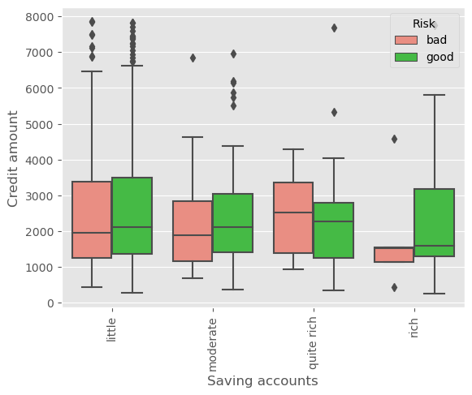
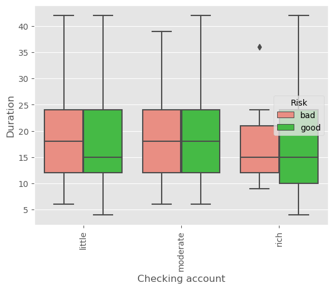

<a href="https://www.kaggle.com/code/wuttipats/german-credit-risk-model-training-and-evaluating?scriptVersionId=150499084" target="_blank"></a>

<div style="text-align: center;">
    
    <p style="text-align: center;"><a href="https://www.freepik.com/free-vector/businessman-pushing-credit-score-speedometer-from-poor-good-tiny-person-improving-personal-credit-history-with-efforts-flat-vector-illustration-business-reputation-customer-loan-concept_21683311.htm#query=credit%20score&position=4&from_view=search&track=ais">Image by freepik</a><p>
</div>


```python
import os
iskaggle = os.environ.get('KAGGLE_KERNEL_RUN_TYPE')

if iskaggle:
    path = '/kaggle/input/german-credit-data-with-risk'
else:
    path = "{}".format(os.getcwd())
```


```python
import pandas as pd
import numpy as np
import matplotlib.pyplot as plt
import seaborn as sns
plt.style.use('ggplot')
color_dict = {'good': 'limegreen', 'bad': 'salmon'}
```


```python
data = pd.read_csv(os.path.join(path,'german_credit_data.csv'), index_col=0)
```


```python
display(data.head())
```


<div>
<style scoped>
    .dataframe tbody tr th:only-of-type {
        vertical-align: middle;
    }

    .dataframe tbody tr th {
        vertical-align: top;
    }

    .dataframe thead th {
        text-align: right;
    }
</style>
<table border="1" class="dataframe">
  <thead>
    <tr style="text-align: right;">
      <th></th>
      <th>Age</th>
      <th>Sex</th>
      <th>Job</th>
      <th>Housing</th>
      <th>Saving accounts</th>
      <th>Checking account</th>
      <th>Credit amount</th>
      <th>Duration</th>
      <th>Purpose</th>
      <th>Risk</th>
    </tr>
  </thead>
  <tbody>
    <tr>
      <th>0</th>
      <td>67</td>
      <td>male</td>
      <td>2</td>
      <td>own</td>
      <td>NaN</td>
      <td>little</td>
      <td>1169</td>
      <td>6</td>
      <td>radio/TV</td>
      <td>good</td>
    </tr>
    <tr>
      <th>1</th>
      <td>22</td>
      <td>female</td>
      <td>2</td>
      <td>own</td>
      <td>little</td>
      <td>moderate</td>
      <td>5951</td>
      <td>48</td>
      <td>radio/TV</td>
      <td>bad</td>
    </tr>
    <tr>
      <th>2</th>
      <td>49</td>
      <td>male</td>
      <td>1</td>
      <td>own</td>
      <td>little</td>
      <td>NaN</td>
      <td>2096</td>
      <td>12</td>
      <td>education</td>
      <td>good</td>
    </tr>
    <tr>
      <th>3</th>
      <td>45</td>
      <td>male</td>
      <td>2</td>
      <td>free</td>
      <td>little</td>
      <td>little</td>
      <td>7882</td>
      <td>42</td>
      <td>furniture/equipment</td>
      <td>good</td>
    </tr>
    <tr>
      <th>4</th>
      <td>53</td>
      <td>male</td>
      <td>2</td>
      <td>free</td>
      <td>little</td>
      <td>little</td>
      <td>4870</td>
      <td>24</td>
      <td>car</td>
      <td>bad</td>
    </tr>
  </tbody>
</table>
</div>


```python
display(data.info())
```

    <class 'pandas.core.frame.DataFrame'>
    Int64Index: 1000 entries, 0 to 999
    Data columns (total 10 columns):
     #   Column            Non-Null Count  Dtype 
    ---  ------            --------------  ----- 
     0   Age               1000 non-null   int64 
     1   Sex               1000 non-null   object
     2   Job               1000 non-null   int64 
     3   Housing           1000 non-null   object
     4   Saving accounts   817 non-null    object
     5   Checking account  606 non-null    object
     6   Credit amount     1000 non-null   int64 
     7   Duration          1000 non-null   int64 
     8   Purpose           1000 non-null   object
     9   Risk              1000 non-null   object
    dtypes: int64(4), object(6)
    memory usage: 85.9+ KB
    


    None


```python
# Convert 'Job' column dtype from 'int64' to 'category'
data.Job = data.Job.astype('category')

# Identify categorical columns based on data type
categorical_columns = data.select_dtypes(include=['object', 'category']).columns
data[categorical_columns] = data[categorical_columns].astype('category')
print('Unique values for every categorical columns in dataset\n')
    
# Loop through each categorical column and print unique values
for column in categorical_columns:
    print(f"\t{column}: {list(data[column].unique())}\n")

```

    Unique values for every categorical columns in dataset
    
    	Sex: ['male', 'female']
    
    	Job: [2, 1, 3, 0]
    
    	Housing: ['own', 'free', 'rent']
    
    	Saving accounts: [nan, 'little', 'quite rich', 'rich', 'moderate']
    
    	Checking account: ['little', 'moderate', nan, 'rich']
    
    	Purpose: ['radio/TV', 'education', 'furniture/equipment', 'car', 'business', 'domestic appliances', 'repairs', 'vacation/others']
    
    	Risk: ['good', 'bad']
    
    


```python
display(data.describe())
```


<div>
<style scoped>
    .dataframe tbody tr th:only-of-type {
        vertical-align: middle;
    }

    .dataframe tbody tr th {
        vertical-align: top;
    }

    .dataframe thead th {
        text-align: right;
    }
</style>
<table border="1" class="dataframe">
  <thead>
    <tr style="text-align: right;">
      <th></th>
      <th>Age</th>
      <th>Credit amount</th>
      <th>Duration</th>
    </tr>
  </thead>
  <tbody>
    <tr>
      <th>count</th>
      <td>1000.000000</td>
      <td>1000.000000</td>
      <td>1000.000000</td>
    </tr>
    <tr>
      <th>mean</th>
      <td>35.546000</td>
      <td>3271.258000</td>
      <td>20.903000</td>
    </tr>
    <tr>
      <th>std</th>
      <td>11.375469</td>
      <td>2822.736876</td>
      <td>12.058814</td>
    </tr>
    <tr>
      <th>min</th>
      <td>19.000000</td>
      <td>250.000000</td>
      <td>4.000000</td>
    </tr>
    <tr>
      <th>25%</th>
      <td>27.000000</td>
      <td>1365.500000</td>
      <td>12.000000</td>
    </tr>
    <tr>
      <th>50%</th>
      <td>33.000000</td>
      <td>2319.500000</td>
      <td>18.000000</td>
    </tr>
    <tr>
      <th>75%</th>
      <td>42.000000</td>
      <td>3972.250000</td>
      <td>24.000000</td>
    </tr>
    <tr>
      <th>max</th>
      <td>75.000000</td>
      <td>18424.000000</td>
      <td>72.000000</td>
    </tr>
  </tbody>
</table>
</div>


```python
display(data.nunique())
```


    Age                  53
    Sex                   2
    Job                   4
    Housing               3
    Saving accounts       4
    Checking account      3
    Credit amount       921
    Duration             33
    Purpose               8
    Risk                  2
    dtype: int64


```python
sns.heatmap(data.isna())
plt.show()
print(data.isna().sum())
```


    

    


    Age                   0
    Sex                   0
    Job                   0
    Housing               0
    Saving accounts     183
    Checking account    394
    Credit amount         0
    Duration              0
    Purpose               0
    Risk                  0
    dtype: int64
    


```python
data.duplicated().sum()
```


    0


# Data Cleaning


```python
df_cleaned = data.copy()
```


```python
# Data Imputing
for column in categorical_columns:
    most_frequent = df_cleaned[column].mode()[0]  # Get the most frequent value for each column
    df_cleaned[column].fillna(most_frequent, inplace=True)  # Fill NaN values with the most frequent value
```


```python
df_cleaned.info()
```

    <class 'pandas.core.frame.DataFrame'>
    Int64Index: 1000 entries, 0 to 999
    Data columns (total 10 columns):
     #   Column            Non-Null Count  Dtype   
    ---  ------            --------------  -----   
     0   Age               1000 non-null   int64   
     1   Sex               1000 non-null   category
     2   Job               1000 non-null   category
     3   Housing           1000 non-null   category
     4   Saving accounts   1000 non-null   category
     5   Checking account  1000 non-null   category
     6   Credit amount     1000 non-null   int64   
     7   Duration          1000 non-null   int64   
     8   Purpose           1000 non-null   category
     9   Risk              1000 non-null   category
    dtypes: category(7), int64(3)
    memory usage: 39.3 KB
    


```python
# Remove Outliers
def remove_outliers(df, column):
    Q1 = df[column].quantile(0.25)
    Q3 = df[column].quantile(0.75)
    IQR = Q3-Q1
    lower = Q1-1.5*IQR
    upper = Q3+1.5*IQR
    
    return df.loc[(df[column] >= lower) & (df[column] <= upper)]

numerical_columns = df_cleaned.select_dtypes('int64').columns

# Apply to 'numerical' columns
for col in numerical_columns:
    df_cleaned = remove_outliers(df_cleaned, col)
```


```python
display(df_cleaned.describe())
```


<div>
<style scoped>
    .dataframe tbody tr th:only-of-type {
        vertical-align: middle;
    }

    .dataframe tbody tr th {
        vertical-align: top;
    }

    .dataframe thead th {
        text-align: right;
    }
</style>
<table border="1" class="dataframe">
  <thead>
    <tr style="text-align: right;">
      <th></th>
      <th>Age</th>
      <th>Credit amount</th>
      <th>Duration</th>
    </tr>
  </thead>
  <tbody>
    <tr>
      <th>count</th>
      <td>861.000000</td>
      <td>861.000000</td>
      <td>861.000000</td>
    </tr>
    <tr>
      <th>mean</th>
      <td>34.686411</td>
      <td>2525.218351</td>
      <td>18.088269</td>
    </tr>
    <tr>
      <th>std</th>
      <td>10.264713</td>
      <td>1654.553716</td>
      <td>8.656849</td>
    </tr>
    <tr>
      <th>min</th>
      <td>19.000000</td>
      <td>250.000000</td>
      <td>4.000000</td>
    </tr>
    <tr>
      <th>25%</th>
      <td>27.000000</td>
      <td>1308.000000</td>
      <td>12.000000</td>
    </tr>
    <tr>
      <th>50%</th>
      <td>33.000000</td>
      <td>2064.000000</td>
      <td>18.000000</td>
    </tr>
    <tr>
      <th>75%</th>
      <td>41.000000</td>
      <td>3349.000000</td>
      <td>24.000000</td>
    </tr>
    <tr>
      <th>max</th>
      <td>64.000000</td>
      <td>7865.000000</td>
      <td>42.000000</td>
    </tr>
  </tbody>
</table>
</div>


# Data Visaulizing


```python
ordered_colors = [color_dict[label] for label in df_cleaned['Risk'].value_counts().index]
df_cleaned['Risk'].value_counts().plot(kind='bar', color=ordered_colors)
plt.show()
```


    

    


```python
sns.histplot(data=df_cleaned, x='Age', hue='Risk', binrange=[0,80], binwidth=10, palette=color_dict, multiple='fill')
plt.show()
```


    

    


```python
sns.histplot(data=df_cleaned, x='Credit amount', hue='Risk', binrange=[0,8000], binwidth=1000,palette=color_dict, multiple='fill')
plt.show()
```


    

    


```python
sns.histplot(data=df_cleaned, x='Duration', hue='Risk', binrange=[0,40], binwidth=5,palette=color_dict, multiple='fill')
plt.show()
```


    

    


```python
# Boxplot 'numrical' variables across all 'categorical' vaiables
def create_plot0(df, categorical_cols, numerical_cols ,hue):
    for cat in categorical_cols:
        df = df.sort_values(cat)
        for num in numerical_cols:
            sns.boxplot(x=cat, y=num, hue=hue, data=df, palette=color_dict)
            plt.tight_layout
            plt.xticks(rotation=90)
            plt.show()
            print("\n\n")
            
create_plot0(df_cleaned, categorical_columns.drop('Risk'), numerical_columns, 'Risk')

```


    

    


    
    
    
    


    

    


    
    
    
    


    

    


    
    
    
    


    

    


    
    
    
    


    

    


    
    
    
    


    

    


    
    
    
    


    

    


    
    
    
    


    

    


    
    
    
    


    

    


    
    
    
    


    

    


    
    
    
    


    

    


    
    
    
    


    

    


    
    
    
    


    

    


    
    
    
    


    

    


    
    
    
    


    

    


    
    
    
    


    

    


    
    
    
    


    

    


    
    
    
    


    

    


    
    
    
    


```python
# Plots Categories Columns
def create_plots_1(df, cat_feature, hue_feature):
    
    df = df.sort_values(cat_feature)
    fig, axes = plt.subplots(1, 2, figsize=(15, 6))
    
    
    # Plot for count plot
    sns.countplot(x=cat_feature, hue=hue_feature, data=df, ax=axes[0], palette=color_dict)
    axes[0].set_title(f'Count Plot of {cat_feature} vs. {hue_feature}')
    axes[0].set_xticklabels(axes[0].get_xticklabels(), rotation=90)

    # Plot for 100% stacked bar chart
    ct = pd.crosstab(df[cat_feature], df[hue_feature])
    ct_percentage = ct.div(ct.sum(axis=1), axis=0) * 100
    ct_percentage.plot(kind='bar', stacked=True, ax=axes[1], color=[color_dict[hue] for hue in ct.columns])
    axes[1].set_ylabel('Percentage')
    axes[1].set_title(f'100% Stacked Bar Chart of {cat_feature} vs. {hue_feature}')

    plt.tight_layout()
    plt.show()


for col in categorical_columns.drop('Risk'):
    create_plots_1(df_cleaned, col, 'Risk')

```


    

    


    

    


    

    


    

    


    

    


    

    


# Data Preprocessing


```python
from sklearn.preprocessing import MinMaxScaler
from sklearn.preprocessing import OneHotEncoder
from sklearn.model_selection import train_test_split

X = df_cleaned.drop(columns=['Risk'])
y = df_cleaned['Risk']
X_transformed = X.copy()
```


```python
# Features Viriables Scaling
scaler = MinMaxScaler()
scaler.fit(X_transformed[numerical_columns])
X_transformed[numerical_columns] = scaler.transform(X_transformed[numerical_columns])
```


```python
display(X_transformed.head())
```


<div>
<style scoped>
    .dataframe tbody tr th:only-of-type {
        vertical-align: middle;
    }

    .dataframe tbody tr th {
        vertical-align: top;
    }

    .dataframe thead th {
        text-align: right;
    }
</style>
<table border="1" class="dataframe">
  <thead>
    <tr style="text-align: right;">
      <th></th>
      <th>Age</th>
      <th>Sex</th>
      <th>Job</th>
      <th>Housing</th>
      <th>Saving accounts</th>
      <th>Checking account</th>
      <th>Credit amount</th>
      <th>Duration</th>
      <th>Purpose</th>
    </tr>
  </thead>
  <tbody>
    <tr>
      <th>2</th>
      <td>0.666667</td>
      <td>male</td>
      <td>1</td>
      <td>own</td>
      <td>little</td>
      <td>little</td>
      <td>0.242416</td>
      <td>0.210526</td>
      <td>education</td>
    </tr>
    <tr>
      <th>4</th>
      <td>0.755556</td>
      <td>male</td>
      <td>2</td>
      <td>free</td>
      <td>little</td>
      <td>little</td>
      <td>0.606697</td>
      <td>0.526316</td>
      <td>car</td>
    </tr>
    <tr>
      <th>6</th>
      <td>0.755556</td>
      <td>male</td>
      <td>2</td>
      <td>own</td>
      <td>quite rich</td>
      <td>little</td>
      <td>0.339462</td>
      <td>0.526316</td>
      <td>furniture/equipment</td>
    </tr>
    <tr>
      <th>7</th>
      <td>0.355556</td>
      <td>male</td>
      <td>3</td>
      <td>rent</td>
      <td>little</td>
      <td>moderate</td>
      <td>0.879580</td>
      <td>0.842105</td>
      <td>car</td>
    </tr>
    <tr>
      <th>8</th>
      <td>0.933333</td>
      <td>male</td>
      <td>1</td>
      <td>own</td>
      <td>rich</td>
      <td>little</td>
      <td>0.368877</td>
      <td>0.210526</td>
      <td>radio/TV</td>
    </tr>
  </tbody>
</table>
</div>


```python
# OneHotEncoder
for col in [item for item in categorical_columns if item not in ['Risk']]:
    dummies = pd.get_dummies(X_transformed[col], prefix=col)
    X_transformed.drop(col, axis=1, inplace=True)
    X_transformed = pd.concat([X_transformed, dummies], axis=1)
```


```python
display(X_transformed.head())
```


<div>
<style scoped>
    .dataframe tbody tr th:only-of-type {
        vertical-align: middle;
    }

    .dataframe tbody tr th {
        vertical-align: top;
    }

    .dataframe thead th {
        text-align: right;
    }
</style>
<table border="1" class="dataframe">
  <thead>
    <tr style="text-align: right;">
      <th></th>
      <th>Age</th>
      <th>Credit amount</th>
      <th>Duration</th>
      <th>Sex_female</th>
      <th>Sex_male</th>
      <th>Job_0</th>
      <th>Job_1</th>
      <th>Job_2</th>
      <th>Job_3</th>
      <th>Housing_free</th>
      <th>...</th>
      <th>Checking account_moderate</th>
      <th>Checking account_rich</th>
      <th>Purpose_business</th>
      <th>Purpose_car</th>
      <th>Purpose_domestic appliances</th>
      <th>Purpose_education</th>
      <th>Purpose_furniture/equipment</th>
      <th>Purpose_radio/TV</th>
      <th>Purpose_repairs</th>
      <th>Purpose_vacation/others</th>
    </tr>
  </thead>
  <tbody>
    <tr>
      <th>2</th>
      <td>0.666667</td>
      <td>0.242416</td>
      <td>0.210526</td>
      <td>0</td>
      <td>1</td>
      <td>0</td>
      <td>1</td>
      <td>0</td>
      <td>0</td>
      <td>0</td>
      <td>...</td>
      <td>0</td>
      <td>0</td>
      <td>0</td>
      <td>0</td>
      <td>0</td>
      <td>1</td>
      <td>0</td>
      <td>0</td>
      <td>0</td>
      <td>0</td>
    </tr>
    <tr>
      <th>4</th>
      <td>0.755556</td>
      <td>0.606697</td>
      <td>0.526316</td>
      <td>0</td>
      <td>1</td>
      <td>0</td>
      <td>0</td>
      <td>1</td>
      <td>0</td>
      <td>1</td>
      <td>...</td>
      <td>0</td>
      <td>0</td>
      <td>0</td>
      <td>1</td>
      <td>0</td>
      <td>0</td>
      <td>0</td>
      <td>0</td>
      <td>0</td>
      <td>0</td>
    </tr>
    <tr>
      <th>6</th>
      <td>0.755556</td>
      <td>0.339462</td>
      <td>0.526316</td>
      <td>0</td>
      <td>1</td>
      <td>0</td>
      <td>0</td>
      <td>1</td>
      <td>0</td>
      <td>0</td>
      <td>...</td>
      <td>0</td>
      <td>0</td>
      <td>0</td>
      <td>0</td>
      <td>0</td>
      <td>0</td>
      <td>1</td>
      <td>0</td>
      <td>0</td>
      <td>0</td>
    </tr>
    <tr>
      <th>7</th>
      <td>0.355556</td>
      <td>0.879580</td>
      <td>0.842105</td>
      <td>0</td>
      <td>1</td>
      <td>0</td>
      <td>0</td>
      <td>0</td>
      <td>1</td>
      <td>0</td>
      <td>...</td>
      <td>1</td>
      <td>0</td>
      <td>0</td>
      <td>1</td>
      <td>0</td>
      <td>0</td>
      <td>0</td>
      <td>0</td>
      <td>0</td>
      <td>0</td>
    </tr>
    <tr>
      <th>8</th>
      <td>0.933333</td>
      <td>0.368877</td>
      <td>0.210526</td>
      <td>0</td>
      <td>1</td>
      <td>0</td>
      <td>1</td>
      <td>0</td>
      <td>0</td>
      <td>0</td>
      <td>...</td>
      <td>0</td>
      <td>0</td>
      <td>0</td>
      <td>0</td>
      <td>0</td>
      <td>0</td>
      <td>0</td>
      <td>1</td>
      <td>0</td>
      <td>0</td>
    </tr>
  </tbody>
</table>
<p>5 rows × 27 columns</p>
</div>


```python
# Apply SMOTE
from imblearn.over_sampling import SMOTE

def smote(X, y, sampling_strategy='minority'):
    
    # Original label
    print('Before')
    print(f'{y.value_counts()}')
    
    # Initialize SMOTE
    smote = SMOTE(sampling_strategy='minority', random_state=21)

    # Apply SMOTE to our data and check the counts
    X_smote, y_smote = smote.fit_resample(X, y)

    # Convert the result back to a dataframe
    X_smote_df = pd.DataFrame(X_smote, columns=X.columns)
    
    # Transformed label
    print('\n\nAfter SMOTE')
    print(f'{y_smote.value_counts()}')

    return X_smote_df, y_smote

X_transformed, y = smote(X_transformed,y)


```

    Before
    good    633
    bad     228
    Name: Risk, dtype: int64
    
    
    After SMOTE
    bad     633
    good    633
    Name: Risk, dtype: int64
    


```python
X_train, X_test, y_train, y_test = train_test_split(X_transformed, y, test_size=0.2, random_state=21)
```

# Model Training and Evaluating


```python
from sklearn.metrics import classification_report
from sklearn.metrics import accuracy_score
from sklearn.metrics import confusion_matrix
from sklearn.metrics import roc_auc_score
from sklearn.metrics import roc_curve
from sklearn.metrics import auc
from sklearn.metrics import precision_recall_fscore_support

import time

from sklearn.linear_model import LogisticRegression
from sklearn.naive_bayes import GaussianNB
from sklearn.tree import DecisionTreeClassifier
from sklearn.ensemble import RandomForestClassifier
from sklearn.ensemble import AdaBoostClassifier
from sklearn.ensemble import GradientBoostingClassifier
from catboost import CatBoostClassifier
```


```python
from sklearn.model_selection import StratifiedKFold, cross_validate


# Initialize the models
models = {
    'Logistic Regression': LogisticRegression(),
    'Gaussian NB': GaussianNB(),
    'Decision Tree': DecisionTreeClassifier(),
    'Random Forest': RandomForestClassifier(),
    'AdaBoost': AdaBoostClassifier(),
    'Gradient Boosting': GradientBoostingClassifier(),
    'CatBoost': CatBoostClassifier(verbose=0)  # Set verbose=0 to not print training progress
}

# Initialize the StratifiedKFold object
kfold = StratifiedKFold(n_splits=5, shuffle=True, random_state=21)

# Define the scoring metrics we want to compute
scoring = ['roc_auc']

for model_name, model in models.items():
    # Use cross_validate to get the scores for each fold
    scores = cross_validate(model, X_transformed, y, cv=kfold, scoring=scoring)

    # Print the mean and std for each metric
    for metric_name, score_values in scores.items():
        if metric_name not in ['fit_time', 'score_time']:
            print(f"{model_name} {metric_name}: {np.mean(score_values):.2f} ± {np.std(score_values):.2f}")

```

    Logistic Regression test_roc_auc: 0.81 ± 0.03
    Gaussian NB test_roc_auc: 0.69 ± 0.02
    Decision Tree test_roc_auc: 0.70 ± 0.03
    Random Forest test_roc_auc: 0.87 ± 0.01
    AdaBoost test_roc_auc: 0.76 ± 0.03
    Gradient Boosting test_roc_auc: 0.82 ± 0.02
    CatBoost test_roc_auc: 0.86 ± 0.01
    


```python
def run_model_and_evaluate(model, X_train, X_test, y_train, y_test):
    
    start_time = time.time()  # Start the timer

    # Train the model
    model.fit(X_train, y_train)

    # Predict on test set
    y_pred = model.predict(X_test)
    y_pred_proba = model.predict_proba(X_test)[:, 1]  # Get the probability of the positive class
    
    # Stop the timer
    end_time = time.time()
    elapsed_time = end_time - start_time  # Calculate elapsed time in seconds

    # Evaluate classifier's performance
    accuracy = accuracy_score(y_test, y_pred)
    roc_auc = roc_auc_score(y_test, y_pred_proba)  # Use probabilities to compute ROC AUC
    
    precision, recall, f1, _ = precision_recall_fscore_support(y_test, y_pred, average=None)
    
    metrics_dict = {
        'running_time': elapsed_time,
        'accuracy': accuracy,
        'roc_auc': roc_auc,
        'precision': precision,
        'recall': recall,
        'f1_score': f1
    }

    print(f"Running Time: {elapsed_time:.2f} seconds")
    print(f"Accuracy: {accuracy}")
    print(f"ROC AUC: {roc_auc}")
    print(classification_report(y_test, y_pred))

    # Compute the confusion matrix
    cm = confusion_matrix(y_test, y_pred)
    
    # ROC curve
    fpr, tpr, thresholds = roc_curve(y_test.map({'bad':0, 'good':1}), y_pred_proba)    

    fig, axes = plt.subplots(1, 2, figsize=(8, 4))

    # Confusion matrix
    sns.heatmap(cm, annot=True, fmt='g', cmap='Blues', cbar=False,
                xticklabels=["bad", "good"], yticklabels=["bad", "good"], ax=axes[0])
    axes[0].set_xlabel('Predicted labels')
    axes[0].set_ylabel('True labels')
    axes[0].set_title('Confusion Matrix')

    # ROC curve
    axes[1].plot(fpr, tpr, color='blue', lw=2, label=f'ROC curve (area = {roc_auc:.2f})')
    axes[1].plot([0, 1], [0, 1], color='gray', lw=2, linestyle='--')
    axes[1].set_xlabel('False Positive Rate')
    axes[1].set_ylabel('True Positive Rate')
    axes[1].set_title('Receiver Operating Characteristic (ROC) Curve')
    axes[1].legend(loc='lower right')
    axes[1].grid(alpha=0.2)

    plt.tight_layout()
    plt.show()
    
    return metrics_dict
```


```python
lr = run_model_and_evaluate(LogisticRegression(), X_train, X_test, y_train, y_test)
```

    Running Time: 0.03 seconds
    Accuracy: 0.7480314960629921
    ROC AUC: 0.8003479773814701
                  precision    recall  f1-score   support
    
             bad       0.77      0.68      0.72       121
            good       0.73      0.81      0.77       133
    
        accuracy                           0.75       254
       macro avg       0.75      0.74      0.75       254
    weighted avg       0.75      0.75      0.75       254
    
    


    

    


```python
nb = run_model_and_evaluate(GaussianNB(), X_train, X_test, y_train, y_test)
```

    Running Time: 0.02 seconds
    Accuracy: 0.547244094488189
    ROC AUC: 0.6517740632573168
                  precision    recall  f1-score   support
    
             bad       0.52      0.84      0.64       121
            good       0.66      0.28      0.39       133
    
        accuracy                           0.55       254
       macro avg       0.59      0.56      0.52       254
    weighted avg       0.59      0.55      0.51       254
    
    


    

    


```python
dt = run_model_and_evaluate(DecisionTreeClassifier(), X_train, X_test, y_train, y_test)
```

    Running Time: 0.03 seconds
    Accuracy: 0.6929133858267716
    ROC AUC: 0.6929720996706642
                  precision    recall  f1-score   support
    
             bad       0.67      0.69      0.68       121
            good       0.71      0.69      0.70       133
    
        accuracy                           0.69       254
       macro avg       0.69      0.69      0.69       254
    weighted avg       0.69      0.69      0.69       254
    
    


    

    


```python
rf = run_model_and_evaluate(RandomForestClassifier(), X_train, X_test, y_train, y_test)
```

    Running Time: 0.63 seconds
    Accuracy: 0.8070866141732284
    ROC AUC: 0.8743242403529484
                  precision    recall  f1-score   support
    
             bad       0.80      0.79      0.80       121
            good       0.81      0.82      0.82       133
    
        accuracy                           0.81       254
       macro avg       0.81      0.81      0.81       254
    weighted avg       0.81      0.81      0.81       254
    
    


    

    


```python
ada = run_model_and_evaluate(AdaBoostClassifier(), X_train, X_test, y_train, y_test)
```

    Running Time: 0.33 seconds
    Accuracy: 0.6811023622047244
    ROC AUC: 0.7612005219660722
                  precision    recall  f1-score   support
    
             bad       0.66      0.69      0.67       121
            good       0.70      0.68      0.69       133
    
        accuracy                           0.68       254
       macro avg       0.68      0.68      0.68       254
    weighted avg       0.68      0.68      0.68       254
    
    


    

    


```python
gdb = run_model_and_evaluate(GradientBoostingClassifier(), X_train, X_test, y_train, y_test)
```

    Running Time: 0.50 seconds
    Accuracy: 0.7283464566929134
    ROC AUC: 0.8159758901385695
                  precision    recall  f1-score   support
    
             bad       0.72      0.70      0.71       121
            good       0.74      0.75      0.74       133
    
        accuracy                           0.73       254
       macro avg       0.73      0.73      0.73       254
    weighted avg       0.73      0.73      0.73       254
    
    


    

    


```python
cat = run_model_and_evaluate(CatBoostClassifier(verbose=0), X_train, X_test, y_train, y_test)
```

    Running Time: 3.95 seconds
    Accuracy: 0.7716535433070866
    ROC AUC: 0.8480084508792642
                  precision    recall  f1-score   support
    
             bad       0.76      0.76      0.76       121
            good       0.78      0.78      0.78       133
    
        accuracy                           0.77       254
       macro avg       0.77      0.77      0.77       254
    weighted avg       0.77      0.77      0.77       254
    
    


    

    

